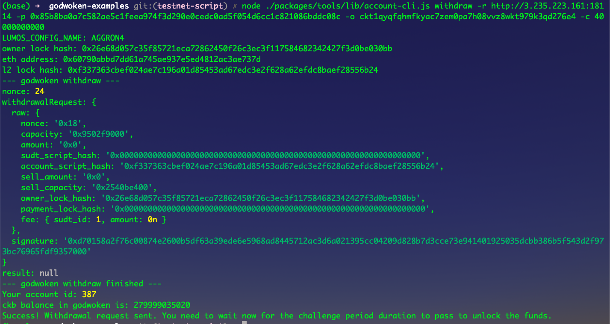

# Gitcoin: 9) Initiate Withdrawal Process From The Layer 2 Back To Layer 1

## 1. A screenshot of the console output immediately after running the withdraw command:


## 2. The Ethereum address that I've used for your Layer 2 account:
```sh
0x60790ABBD7dd61a745Ae937E5ed4812AC3aE737D
```

## 3. The Nervos Layer 1 address that I passed to withdraw command:
```sh
ckt1qyqfqhmfkyac7zem0pa7h08vvz8wkt979k3qd276e4
```
